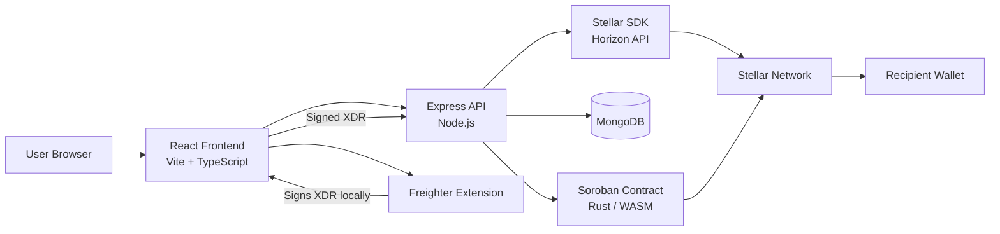
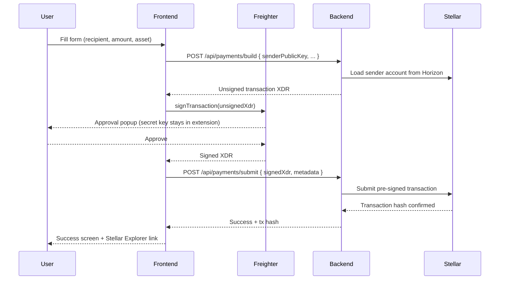

# ⚡ SwiftRemit
### Instant Cross-Border Payments for Africa — Powered by Stellar

[](https://stellar.org)
[](https://soroban.stellar.org)
[](https://stellar.expert/explorer/testnet)
[](https://react.dev)
[](https://expressjs.com)

---

## 📌 Overview

SwiftRemit is a full-stack blockchain-powered cross-border payment platform built to eliminate the high costs and slow settlement times of international money transfers in Africa.

Built on the **Stellar network**, SwiftRemit enables near-instant, low-cost payments using **XLM and USDC stablecoins** — settling in 3–5 seconds for fractions of a cent per transaction.

Transactions are signed by the user's **Freighter browser wallet** — secret keys never leave the user's device or touch the server.

---

## 🌍 Problem Statement

| Problem | Traditional | SwiftRemit |
|---|---|---|
| Transaction fees | 5–10% | ~$0.00001 |
| Settlement time | 2–5 days | 3–5 seconds |
| Accessibility | Bank required | Wallet-based |
| Key security | N/A | Secret key never leaves device |
| Transparency | Opaque | On-chain, verifiable |

---

## ✨ Features

- 🦊 **Freighter Wallet Integration** — connect your Stellar browser wallet; secret key never shared
- 🔑 **Managed Wallet** — generate a Stellar keypair directly in the app
- 💸 **Secure Payment Flow** — backend builds unsigned XDR → Freighter signs → backend submits
- 📊 **Transaction Dashboard** — full history with on-chain Stellar Explorer links
- 🔔 **Real-time Feedback** — toast notifications on every action
- 🔐 **JWT Authentication** — secure register/login with bcrypt (12 salt rounds)
- 🛡️ **API Security** — Helmet, CORS, rate limiting (100 req/15 min), express-validator
- 📱 **Mobile Responsive** — fully responsive UI with sticky card scroll animations
- ⭐ **Soroban Smart Contract** — Rust contract compiled to WASM, deployed on Stellar
- 🌐 **Testnet Ready** — Friendbot funding for instant testnet XLM

---

## 🏗️ Architecture



---

## 🔄 Payment Flow — Freighter Signing

Secret keys never leave the browser. The flow is a clean **build → sign → submit** pattern:



---

## 🧠 Tech Stack

### Frontend — `Remit-Frontend`
| Technology | Version | Purpose |
|---|---|---|
| React | 18.3 | UI framework |
| TypeScript | 5.2 | Type safety |
| Vite | 5.3 | Build tool |
| Tailwind CSS | 3.4 | Styling |
| Zustand | 4.5 | State management (persisted auth) |
| Axios | 1.7 | HTTP client with JWT interceptor |
| React Router | 6.24 | Client-side routing |
| React Hot Toast | 2.4 | Notifications |
| Freighter API | 2.0 | Stellar browser wallet |

### Backend — `Remit-Backend`
| Technology | Version | Purpose |
|---|---|---|
| Node.js | 18+ | Runtime |
| Express | 4.22 | API framework |
| MongoDB + Mongoose | 8.23 | Database |
| Stellar SDK | 12.3 | Build XDR, submit transactions |
| JWT | 9.0 | Authentication tokens |
| bcryptjs | 2.4 | Password hashing (12 rounds) |
| Helmet | 7.2 | Security HTTP headers |
| express-rate-limit | 7.5 | Rate limiting |
| express-validator | 7.3 | Input validation |
| Nodemon | 3.1 | Dev auto-restart |

### Smart Contract — `Remit-Contract`
| Technology | Version | Purpose |
|---|---|---|
| Rust | stable | Contract language |
| Soroban SDK | 22.0 | Smart contract framework |
| Stellar CLI | 26.0 | Build, deploy, invoke |
| WASM | — | Compiled target (`wasm32v1-none`) |
| Stellar SDK (JS) | 12.3 | Testnet utility scripts |

---

## 📁 Project Structure

```
SwiftRemit/
│
├── Remit-Frontend/
│   └── src/
│       ├── api/
│       │   ├── axios.ts              # Axios instance, JWT interceptor, 401 handler
│       │   ├── auth.api.ts           # register, login, getMe
│       │   ├── payment.api.ts        # buildPaymentApi, submitPaymentApi
│       │   ├── transaction.api.ts    # getTransactions, getById, getStellarHistory
│       │   └── wallet.api.ts         # createWallet, fundWallet, getBalance
│       ├── components/
│       │   ├── layout/
│       │   │   ├── Layout.tsx        # App shell for authenticated pages
│       │   │   ├── Navbar.tsx        # Top bar with wallet status + logout
│       │   │   └── Sidebar.tsx       # Side nav with wallet SVG icon
│       │   ├── MoneyTransferAnimation.tsx  # Animated hero illustration
│       │   └── TypewriterText.tsx    # Typewriter headline component
│       ├── hooks/
│       │   ├── useFreighter.ts       # Freighter lifecycle: install, connect, sign, disconnect
│       │   └── useInView.ts          # IntersectionObserver for scroll animations
│       ├── pages/
│       │   ├── LandingPage.tsx       # Marketing page with hero, features, how-it-works
│       │   ├── LoginPage.tsx         # Login form with home navigation
│       │   ├── RegisterPage.tsx      # Registration form with home navigation
│       │   ├── DashboardPage.tsx     # Wallet status, balances, recent transactions
│       │   ├── SendPaymentPage.tsx   # 3-step: form → Freighter signing → success
│       │   ├── TransactionsPage.tsx  # Paginated transaction history table
│       │   └── WalletPage.tsx        # Freighter + managed wallet tabs
│       └── store/
│           ├── authStore.ts          # Zustand (persisted): token, user, setAuth, logout
│           └── walletStore.ts        # Zustand: publicKey, balances, isLoading
│
├── Remit-Backend/
│   └── src/
│       ├── config/
│       │   ├── db.js                 # MongoDB connection
│       │   └── stellar.js            # Stellar SDK + Horizon server + network passphrase
│       ├── controllers/
│       │   ├── auth.controller.js    # register, login, getMe
│       │   ├── payment.controller.js # buildTransaction (XDR), submitTransaction (signed XDR)
│       │   ├── transaction.controller.js  # getUserTransactions, getById, getStellarHistory
│       │   └── wallet.controller.js  # createWallet, fundWallet, getBalance
│       ├── middleware/
│       │   ├── auth.middleware.js    # protect: JWT verify + DB user lookup
│       │   ├── error.middleware.js   # notFound, errorHandler (Mongoose + generic)
│       │   └── validate.middleware.js # express-validator result handler
│       ├── models/
│       │   ├── User.model.js         # name, email, password (bcrypt), stellarPublicKey
│       │   └── Transaction.model.js  # sender, recipient, amount, asset, status, txHash
│       ├── routes/
│       │   ├── auth.routes.js        # /register, /login, /me
│       │   ├── payment.routes.js     # /build, /submit
│       │   ├── transaction.routes.js # /, /stellar/:key, /:id
│       │   └── wallet.routes.js      # /create, /fund, /balance/:key
│       ├── services/
│       │   ├── auth.service.js       # registerUser, loginUser, generateToken
│       │   └── stellar.service.js    # buildPaymentXdr, submitSignedTransaction, getAccountBalance, ...
│       ├── app.js                    # Express app: Helmet, CORS, rate limit, routes
│       └── server.js                 # Entry point: DB connect → listen
│
└── Remit-Contract/
    ├── src/
    │   ├── lib.rs                    # Soroban smart contract (Rust)
    │   └── stellar.js                # Node.js Stellar SDK utilities
    ├── scripts/
    │   ├── build.sh                  # stellar contract build → WASM
    │   ├── deploy.sh                 # Deploy + initialize on testnet
    │   ├── invoke.sh                 # Example CLI invocations
    │   ├── setup-testnet.js          # Generate keypair + Friendbot fund
    │   ├── fund-account.js           # Fund existing account
    │   ├── send-payment.js           # Test XLM payment
    │   └── check-balance.js          # Print account balances
    ├── .stellar/
    │   └── network.toml              # Testnet + mainnet RPC config
    └── Cargo.toml                    # Rust dependencies (soroban-sdk 22)
```

---

## 🚀 Getting Started

### Prerequisites
- Node.js 18+
- MongoDB (local or [Atlas](https://mongodb.com/atlas))
- Rust + Cargo (`rustup`)
- [Freighter browser extension](https://www.freighter.app/)
- Stellar CLI (`cargo install --locked stellar-cli`)

### 1. Clone the repos

```bash
git clone https://github.com/SwiftRemit/Remit-Frontend.git
git clone https://github.com/SwiftRemit/Remit-Backend.git
git clone https://github.com/SwiftRemit/Remit-Contract.git
```

### 2. Backend

```bash
cd Remit-Backend
npm install
cp .env.example .env
# Set MONGO_URI and JWT_SECRET in .env
npm run dev          # → http://localhost:5000
```

### 3. Frontend

```bash
cd Remit-Frontend
npm install
npm run dev          # → http://localhost:5173
```

### 4. Smart Contract

```bash
cd Remit-Contract
# Add wasm target
rustup target add wasm32v1-none

# Build WASM
stellar contract build
# → target/wasm32v1-none/release/remit_contract.wasm (8,868 bytes)

# Run tests (5/5 pass)
cargo test

# Deploy to testnet
cp .env.example .env   # fill in keypairs
bash scripts/deploy.sh
```

### 5. Testnet wallet setup

```bash
cd Remit-Contract
npm install
npm run setup        # generates keypair + funds via Friendbot
npm run check-balance
```

---

## 🔌 API Reference

| Method | Endpoint | Auth | Description |
|---|---|---|---|
| GET | `/health` | — | Health check |
| POST | `/api/auth/register` | — | Register (name, email, password) → JWT |
| POST | `/api/auth/login` | — | Login → JWT |
| GET | `/api/auth/me` | ✅ | Get current user |
| POST | `/api/wallet/create` | ✅ | Generate Stellar keypair |
| POST | `/api/wallet/fund` | ✅ | Fund via Friendbot (testnet) |
| GET | `/api/wallet/balance/:publicKey` | ✅ | Get wallet balances from Horizon |
| POST | `/api/payments/build` | ✅ | Build unsigned transaction XDR |
| POST | `/api/payments/submit` | ✅ | Submit Freighter-signed XDR |
| GET | `/api/transactions` | ✅ | List user transactions (paginated) |
| GET | `/api/transactions/stellar/:publicKey` | ✅ | On-chain history from Horizon |
| GET | `/api/transactions/:id` | ✅ | Get transaction by ID |

---

## ⭐ Soroban Contract Functions

| Function | Auth | Description |
|---|---|---|
| `initialize(admin, fee_bps)` | One-time | Deploy and configure. Panics if called again |
| `register(user, display_name)` | `user` | Store display name for a wallet address |
| `get_name(user)` | — | Get display name (empty string if unregistered) |
| `send(from, to, token, amount, memo)` | `from` | Transfer tokens, deduct fee to admin, record on-chain |
| `tx_count(addr)` | — | Total transaction count for an address |
| `get_txs(addr, limit)` | — | Most recent transactions (reverse chronological) |
| `set_fee(new_fee_bps)` | admin | Update protocol fee |
| `transfer_admin(new_admin)` | admin | Transfer admin role |
| `get_fee()` | — | Current fee in basis points |

**Fee structure:** Default 10 bps (0.1%). `fee = amount × fee_bps / 10_000`. Net amount goes to recipient, fee goes to admin.

**WASM output:** `remit_contract.wasm` — 8,868 bytes, 10 exported functions.

---

## 🔐 Security

| Layer | Measure |
|---|---|
| **Key management** | Secret keys never leave the browser — Freighter signs locally |
| **Payment flow** | Backend only handles public keys and pre-signed XDR envelopes |
| **Passwords** | bcrypt with 12 salt rounds |
| **Authentication** | JWT with configurable expiry; `protect` middleware re-fetches user from DB |
| **HTTP headers** | Helmet.js (CSP, HSTS, X-Frame-Options, etc.) |
| **CORS** | Restricted to `FRONTEND_URL` env var |
| **Rate limiting** | 100 requests / 15 minutes per IP |
| **Input validation** | express-validator on all mutation endpoints |
| **Error responses** | Stack traces only in `NODE_ENV=development` |
| **Managed wallet** | Secret key returned once only, never stored in DB |
| **Soroban contract** | `require_auth()` on all state-changing calls; overflow checks enabled |

---

## 🧪 Current Status

- ✅ Full project scaffolded and deployed to GitHub (3 repos)
- ✅ Authentication — register, login, JWT, bcrypt
- ✅ Freighter wallet connect + managed keypair generation
- ✅ Secure payment flow — Freighter signs, secret key never on server
- ✅ Transaction history dashboard with Stellar Explorer links
- ✅ Responsive landing page — typewriter animation, hero illustration, sticky card scroll
- ✅ Soroban smart contract — compiled to WASM, 5/5 tests passing
- ✅ Testnet integration — Friendbot funding, Horizon queries
- 🔄 Soroban contract deployment to testnet
- 🔄 Mainnet launch

---

## 🛣️ Roadmap

- [ ] Soroban contract mainnet deployment
- [ ] Mainnet launch
- [ ] Mobile app (React Native)
- [ ] Fiat on/off ramp (MoMo, bank transfer)
- [ ] Escrow / conditional payments
- [ ] Multi-currency support
- [ ] Push notifications
- [ ] KYC / compliance layer

---

## 📎 Environment Variables

### Remit-Backend `.env`

| Variable | Description |
|---|---|
| `PORT` | Server port (default 5000) |
| `NODE_ENV` | `development` or `production` |
| `MONGO_URI` | MongoDB connection string |
| `JWT_SECRET` | Secret for signing JWT tokens |
| `JWT_EXPIRES_IN` | Token expiry (default `7d`) |
| `STELLAR_NETWORK` | `testnet` or `mainnet` |
| `STELLAR_HORIZON_URL` | Horizon server URL |
| `FRONTEND_URL` | Allowed CORS origin |

### Remit-Contract `.env`

| Variable | Description |
|---|---|
| `STELLAR_NETWORK` | `testnet` or `mainnet` |
| `DEPLOYER_SECRET` | Secret key for deploying contract |
| `ADMIN_PUBLIC_KEY` | Admin address for contract |
| `SENDER_SECRET` | Sender secret for test scripts |
| `SENDER_PUBLIC_KEY` | Sender public key |
| `RECIPIENT_PUBLIC_KEY` | Recipient for test payments |
| `TOKEN_ADDRESS` | SAC token contract address |
| `CONTRACT_ID` | Deployed contract ID (filled by deploy.sh) |

---

## 🤝 Contributing

We welcome contributors in:
- Blockchain / Stellar / Soroban development
- Fintech & payments
- Frontend engineering (React / TypeScript)
- Mobile development (React Native)

---

## 📢 Vision

To power a financially inclusive Africa where anyone can send and receive money globally — without barriers, without delays, without excessive fees.

---

## 🏁 Conclusion

SwiftRemit combines Stellar's speed, Soroban's programmability, and Freighter's secure key management to redefine cross-border payments in Africa — making them faster, cheaper, and safer for everyone.

---

*Built with ⚡ on the Stellar Network · Secured by Freighter · Smart contracts on Soroban*
